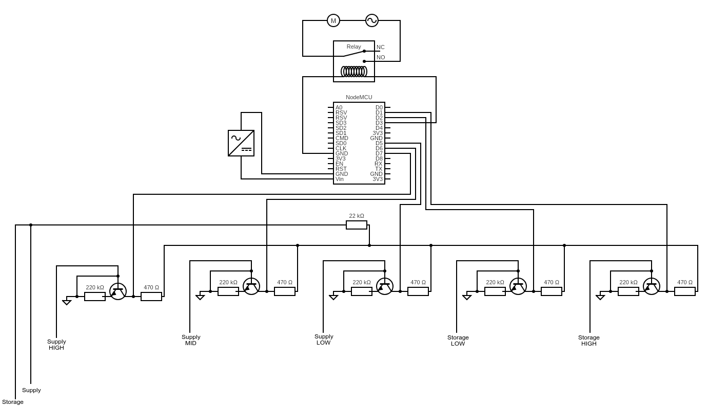

<h1>Elixir</h1>
Elixir is an automation module for dynamic pump control to manage water storage and supply between tanks. The water levels accross tanks can be monitored through the android application which can also be used for manual pump control.

<b>Components Required:</b>

1 X NodeMCU (ESP8266 12E)

1 X Relay Module

5 X BC548C Transistor

5 X 470K Ohm Resistor

5 X 220K Ohm Resistor

5 X 22K Ohm Resistor

<b>Circuit Diagram:</b>

<b>Circuit Intuition:</b>
The supply tank represents the tank to which the pump transfers water and the storage tank is from where the pump draws power.
As mentioned in the circuit diagram, the labelled wires should be fixed thoroughly in the tanks to be monitored. The wires labelled "SUPPLY" and "STORAGE" are to be fixed at the bottom of the tanks. The "LOW", "MID" and "HIGH" wires should be fixed at the desired levels in the tanks.

<b>NodeMCU Setup:</b>
1. Construct the circuit shown in the circuit diagram
2. Open the code file "elixr.ino" in the elixir folder.
3. Fill in your WiFi details in "Setting up ESP8266 libraries and WiFi" section
4. Upload the code.

Just compile and install the android application and the module is up and running.
